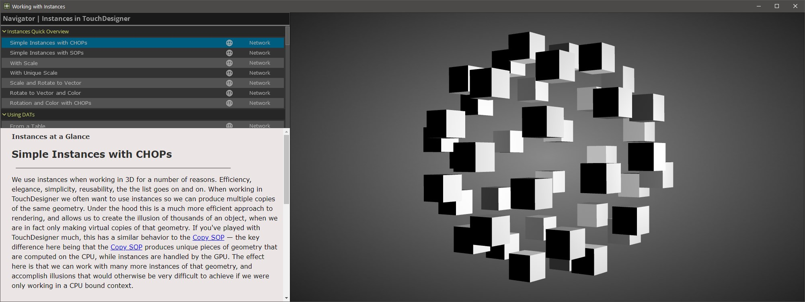
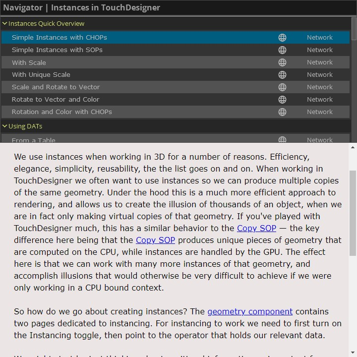
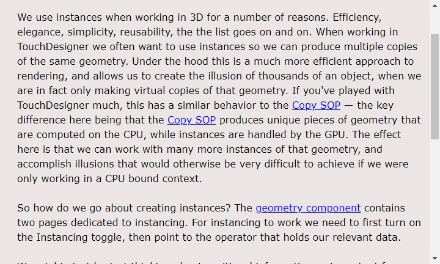
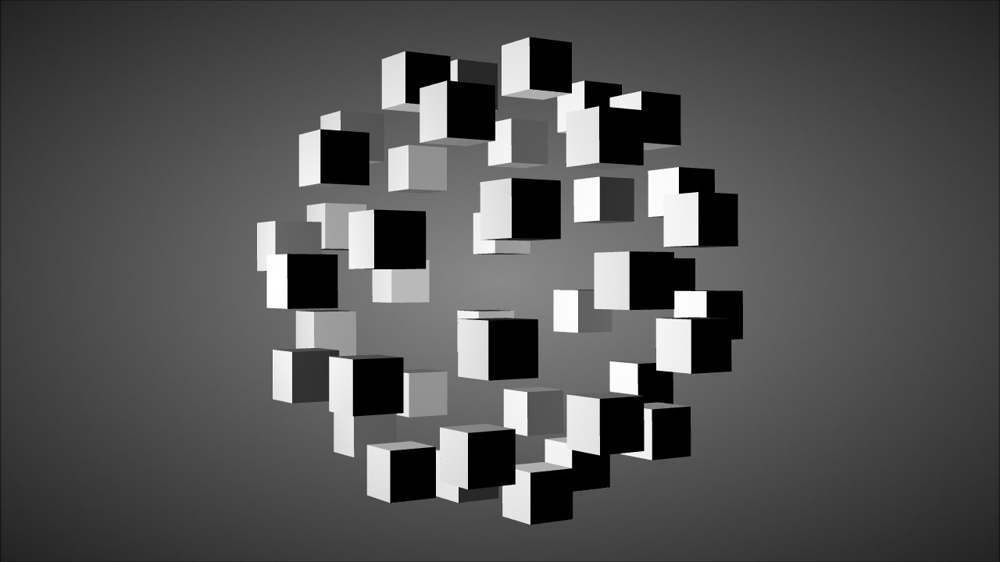
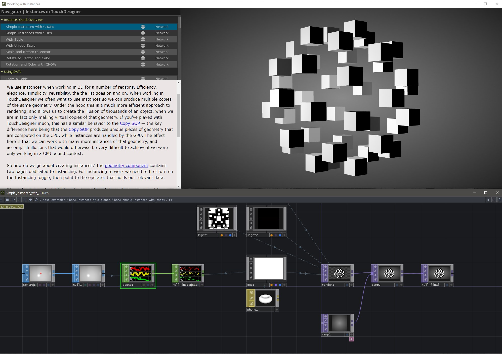

# Instancing Examples

Four years ago [Matthew](http://matthewragan.com/) started collecting examples on working with instances. What started as a rough collection of ideas has turned into a collection of over 40 different examples. 

In this revised set of examples the format and presentation has also changed. Initially the user had to mouse around networks and look for readmes to learn about the examples. In this new version all examples can be explored through a purpose built UI:

This new starting point allows the developer to quickly jump between examples without needing to open the TouchDesigner network. The interface is re-designed with three primary interaction regions in mind: the Navigator, the Readme, and the Liveview.

## The Navigator
The Navigator organizes examples into sensible groupings. These high level containers can be collapsed by clicking on their heading. Each example also includes a button to jump to the example, or to open a TouchDesigner network view of the example. This allows you to both see the example rendered and see how it was built all at the same time. 

## The Readme
The Readme pane has a short description of what you’re seeing. This set of documentation is intended to go along with each specific example and includes discussion about the particular techniques employed. Using the globe network icon on the Navigator will open the readme in your browser if you'd like a slightly larger window for reading through the documentation. 

*Right now there's a small display bug on macOS that prevents the scroll bar from working correctly - that's okay, you can always use the globe icon to open the readme in your default browser instead. You can follow along with the bug report if you're a mac user here.*

## The Liveview
The Liveview let’s you see the output render from the network at a glance — making it easy to determine if this technique is one that you’d like to learn more about. 

In addition to exploring the examples through the viewer, there's also a button to open the network view for the example. This lets you jump immediately into the network and see how the instances were set-up. 

This project has been a labor of love to collect, organize, and compile materials for other passionate developers and educators. We’re hoping that enthusiasts, instructors, and creative developers alike will find this useful and interesting both as a tool and as a reference. 

# Examples

## Instances Quick Overview
* [Simple Instances with CHOPs](pages/base_instances_at_a_glance/simple_readme)
* [Simple Instances with SOPs](pages/base_instances_at_a_glance/simple_sops_readme)
* [With Scale](pages/base_instances_at_a_glance/simple_and_scale_readme)
* [With Unique Scale](pages/base_instances_at_a_glance/simple_and_unique_scale_readme)
* [Scale and Rotate to Vector](pages/base_instances_at_a_glance/simple_scale_rot_to_vector_readme)
* [Rotate to Vector and Color](pages/base_instances_at_a_glance/simple_rot_to_vec_color_readme)
* [Rotation and Color with CHOPs](pages/base_instances_at_a_glance/simple_rot_color_with_chops_readme)

## Using DATs
* [From a Table](pages/base_using_dats/from_table_readme)
* [From a Table with Scale](pages/base_using_dats/from_table_with_scale_readme)
* [Updating Table](pages/base_using_dats/updating_table_readme)
* [From a SOP](pages/base_using_dats/from_sop_readme)
* [Fetched with a Script CHOP](pages/base_using_dats/fetched_with_script_readme)
* [From Storage with a Script CHOP](pages/base_using_dats/from_storage_readme)

## Puzzle Pieces
* [Variation 1 - Texture Instancing](pages/base_puzzle_pieces/puzzle_var1_readme)
* [Variation 2 - 2D Array](pages/base_puzzle_pieces/puzzle_var2_readme)
* [Variation 3 - UV Offset](pages/base_puzzle_pieces/puzzle_var3_readme)

## 2D Arrays  
* [Textures From Video](pages/base_2D_arrays/textures_from_vid_readme)
* [Filmstrip](pages/base_2D_arrays/filmstrip_comp)

## 3D Arrays
* [Video on Instances](pages/base_3D_arrays/video_on_instances_readme)

## Complex Rotation
* [Rotation Calculations with the Object CHOP](pages/base_complex_rotation/manual_rot_calc_obj_chop_readme)
* [Manual Rotation Calculations](pages/base_complex_rotation/manual_rot_calc_readme)
* [The Object CHOP](pages/base_complex_rotation/object_chop01_readme)
* [The Object CHOP and Feedback](pages/base_complex_rotation/object_chop02_readme)

## Instances of Instances
* [Using a Copy SOP](pages/base_instances_of_instances/copy_sop_readme)
* [Static Position](pages/base_instances_of_instances/static_pos_readme)
* [Moving Random Position](pages/base_instances_of_instances/rand_pos_readme)

##  Techniques for Using CHOPs
* 

##  Techniques for Using TOPs
* 

## Techniques for Using SOPs
* [SOP Blending and Rotation](pages/base_using_sops/rot_to_vec_blending_readme)
* [Image Carousel using a line](pages/base_using_sops/using_lines_readme)
* [Image Carousel using a Circle](pages/base_using_sops/using_a_circle_readme)
* [Using Life to Derive Scale](pages/base_using_sops/particles_and_life_readme)
* [Building Cubes with Unique Faces - Cubemaps](pages/base_using_sops/cubes_with_unique_faces_readme)

## The Point File In TOP
* 

## GLSL and Instances
* [Changing Instance Position with GLSL](pages/base_glsl_and_instances/instance_position_with_glsl_readme)
* [Textures to Displace Instances](pages/base_glsl_and_instances/instance_position_from_texture_readme)
* [Color and Scale from Texture](pages/base_glsl_and_instances/color_and_scale_from_texture_readme)
* [2D Texture Arrays and Instancing](pages/base_glsl_and_instances/instancing_with_2D_texture_arrays_readme)
* [Noise Functions for Instances](pages/base_glsl_and_instances/noise_functions_in_gl_readme)
* [Curl Noise Functions for Instances](pages/base_glsl_and_instances/curl_noise_for_instances_readme)

## Pixel Mapping Geometry
* [Step 1](pages/base_pixel_mapping_geometry/step1_readme)
* [Step 2](pages/base_pixel_mapping_geometry/step2_readme)
* [Step 3](pages/base_pixel_mapping_geometry/step3_readme)
* [Step 4](pages/base_pixel_mapping_geometry/step4_readme)

## Miscalanious Techniques
* [Using the Animation COMP](pages/base_misc_techniques/animation_comp_readme)

---

### Thanks

❤️ SOME THANK YOUS FROM MATTHEW ❤️  

...to [Zoe Sandoval](http://zoesandoval.com/) for their tireless work editing, play testing, and making all of these examples better. If it wasn't for their handwork, and attention to detail this tool wouldn't be nearly as complete or well constructed.

... to [Ian Shelanskey](https://ianshelanskey.com/) for his passion and encouragement to keep making examples, and to craft them into a single unified example.

... to [Michael Walczyk](https://michaelwalczyk.com/) for his mentorship, guidance, and constant enthusiasm. I would have been lost in the GLSL wilderness without Mike, and I always appreciate when I can ask him some crazy question about rendering and mathematics.

… to Elburz Sorkhabi and everyone at [The Interactive Immersive HQ](https://interactiveimmersive.io/). Many of you were kind enough to test and look through these examples before posting this. The engagement and hunger for learning TouchDesigner in that community continues to inspire me, and is a reminder about why these kinds of examples are useful and important to share.

... to the [Derivative Team](https://derivative.ca/) for their toolkit that never stops being fun to use, and for their thoughtful feedback and support through building out this collection. From combing through the forum, to late night conversations with Greg and Ben I wouldn't have gotten this far without them.